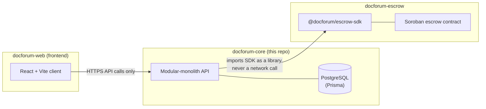

# docforum-core


**The backend of DocForum** — a platform that collapses a multi-visit,
multi-queue hospital journey into one continuous digital thread. A patient
searches for a doctor, books a slot, gets referred to the right specialist
without re-explaining themselves, receives a prescription or lab order, and
gets it fulfilled at a qualified partner facility — all tracked end to end.

This is the **hub repository** of the `DocForum` GitHub organization: it
owns the product definition (PRD), the full system architecture, the data
model, and the master roadmap that the other two repos are scoped against.

**📖 [Browse the docs site](https://docforum.github.io/docforum-core/)** —
PRD, architecture, ADRs, API reference, and every repo's roadmap in one
place, synced at build time from each repo's own files (see
[`docs/site/`](docs/site)).

---

## Table of contents

- [Organization layout](#organization-layout)
- [Tech stack](#tech-stack)
- [Domain model, at a glance](#domain-model-at-a-glance)
- [Backend modules](#backend-modules)
- [Repo layout](#repo-layout)
- [Documentation](#documentation)
- [Getting started](#getting-started)
- [Project status](#project-status)
- [Contributing](#contributing)
- [License](#license)

## Organization layout

`DocForum` is split across three independently-versioned repositories.
This repo is the only one with direct database and PHI (protected health
information) access; the other two are deliberately narrow.



- **[`docforum-web`](https://github.com/DocForum/docforum-web)** — React/TypeScript frontend. Talks only to this repo's API; never calls `docforum-escrow` or Stellar directly.
- **[`docforum-escrow`](https://github.com/DocForum/docforum-escrow)** — Rust/Soroban escrow contract + `@docforum/escrow-sdk`. Consumed here as a *library dependency* by the `payments` module, never called as a running network service — see [`docs/adr/0002-stellar-escrow-for-fulfillment-payout.md`](docs/adr/0002-stellar-escrow-for-fulfillment-payout.md).

Why the split, and why it doesn't contradict "modular monolith, not
microservices" (`ARCHITECTURE.md` §1): see
[`docs/adr/0001-modular-monolith.md`](docs/adr/0001-modular-monolith.md) and
[`docs/adr/0002-stellar-escrow-for-fulfillment-payout.md`](docs/adr/0002-stellar-escrow-for-fulfillment-payout.md).

## Tech stack

| Layer | Choice |
|---|---|
| Runtime / language | Node.js + TypeScript |
| API framework | Express (or Fastify) |
| Database | PostgreSQL |
| ORM / schema | Prisma (`backend/prisma/schema.prisma` is the source of truth) |
| Auth | JWT access + refresh tokens, role claims (`patient` \| `doctor` \| `facility` \| `admin`) |
| Jobs | Simple cron/interval — no queue until a real job needs one |
| Payments | Stellar escrow via `@docforum/escrow-sdk` (see `docforum-escrow`), never custom payment rails |

Full rationale for every choice: [`ARCHITECTURE.md` §2](ARCHITECTURE.md#2-tech-stack).

## Domain model, at a glance

```
User ─┬─ PatientProfile
      ├─ DoctorProfile ──< DoctorSpecialty >── Specialty
      └─ FacilityProfile ──< FacilityCapability

AvailabilitySlot (doctor's calendar) → Appointment → IntakeForm, Consultation
Consultation ──(outcome = referred)──▶ Referral (immutable snapshot!) → new Appointment
Consultation → Prescription (+ PrescriptionItem) / LabOrder (+ LabResult)
FulfillmentRecord (facility-owned) references an order but never mutates it
PaymentIntent / WalletLink — relational metadata only; contract logic lives in docforum-escrow
```

Full field-level schema: [`ARCHITECTURE.md` §4](ARCHITECTURE.md#4-data-models) and [`backend/prisma/schema.prisma`](backend/prisma/schema.prisma) (the two must never drift — schema wins if they do).

**Non-negotiable invariants**, enforced at the architecture level, not just by convention:
- A `Prescription` or `LabOrder` is never mutated after issuance — corrections create a new row via `supersedes_*_id`.
- Availability booking uses a DB-level conditional update/transaction — never an app-level "check then write" (double-booking is the #1 predicted bug class).
- A `Referral` snapshots intake + consultation notes at creation time — it never reads live from the source `Consultation`.
- A facility writes only to its own `FulfillmentRecord`; it never touches `Prescription.status` / `LabOrder.status` directly.

## Backend modules

Each module owns its own `routes/ controllers/ services/ repositories/` and is only ever accessed by other modules through its service interface (`backend/src/modules/<name>/`):

`auth` · `users` · `patients` · `doctors` · `facilities` · `availability` · `appointments` · `consultations` · `referrals` · `prescriptions` · `lab-orders` · `pharmacy-orders` · `payments` · `notifications`

`payments` is the only module allowed to import `@docforum/escrow-sdk`.

## Repo layout

```
backend/
  prisma/schema.prisma   Data model — source of truth
  src/modules/<name>/    routes/ controllers/ services/ repositories/ per module
  src/middleware/        auth, error handling
  src/config/            environment/config loading
  tests/unit/            per-module unit tests
  tests/integration/     booking/referral/order-issuance flows (correctness-critical)
docs/
  adr/                   Architecture decision records
  api/                   API documentation (generated once routes exist)
  site/                  VitePress docs site for the whole org — content synced
                          at build time, never hand-edited (see docs/site/README.md)
infra/docker/            Local dev infra (Postgres, etc.) — not yet written, see ROADMAP.md Phase 1
scripts/                 One-off/dev scripts
.github/                 CI workflow, issue/PR templates
```

## Documentation

Read in this order — `ARCHITECTURE_ESSENTIALS.md` exists specifically so you don't have to load the full architecture doc for a small task:

| Doc | Purpose |
|---|---|
| [`PRD.md`](PRD.md) | What we're building, for whom, and why — personas, user flows, functional requirements, explicit non-goals, and a running list of "what would break / edge cases / overengineered" hard questions. |
| [`ARCHITECTURE_ESSENTIALS.md`](ARCHITECTURE_ESSENTIALS.md) | Fast-reference: stack, hard rules, data-model map, known unresolved design gaps, overengineering guardrails. |
| [`ARCHITECTURE.md`](ARCHITECTURE.md) | Full reasoning: tech stack rationale, module boundaries, complete data models, key flows, architecture-level hard questions. |
| [`ROADMAP.md`](ROADMAP.md) | Phased plan and current status — updated on every contribution that touches roadmap-tracked work. |
| [`AGENTS.md`](AGENTS.md) / [`CLAUDE.md`](CLAUDE.md) | Rules for coding agents (human- or AI-directed) working in this repo. |
| `docs/adr/` | Architecture decision records — [0001](docs/adr/0001-modular-monolith.md) (modular monolith over microservices), [0002](docs/adr/0002-stellar-escrow-for-fulfillment-payout.md) (Stellar escrow as a consumed library; the 3-repo org split). |

## Getting started

Needs a Postgres instance — either `infra/docker/docker-compose.yml`
(**written but not exercised in this environment** — no Docker available
where this was built; developed and tested against a local Postgres via
the `embedded-postgres` devDependency instead, see below) or your own.

```bash
git clone https://github.com/DocForum/docforum-core.git
cd docforum-core/backend
npm install
cp .env.example .env   # fill in DATABASE_URL, JWT_ACCESS_SECRET, JWT_REFRESH_SECRET
npx prisma migrate deploy   # applies backend/prisma/migrations/
npm run dev                 # → http://localhost:4000, GET /health to check
```

| Command | What it does |
|---|---|
| `npm run dev` | `tsx watch` dev server |
| `npm run build` | Typecheck + compile to `dist/` |
| `npm start` | Run the compiled `dist/server.js` |
| `npm test` | Unit tests only (no DB needed) |
| `npm run test:integration` | The booking-concurrency test — **spins up its own throwaway Postgres** (via `embedded-postgres`, a prebuilt binary) on port 5433, so this needs no pre-existing DB either |
| `npm run test:all` | Everything |

All of the above are real and verified: signup → doctor verification →
slot generation → booking → the concurrency guarantee, all exercised
end-to-end (manually via curl and automatically in
`backend/tests/integration/booking.test.mts`). API reference:
[`docs/api/README.md`](docs/api/README.md).

## Project status

**Phase 0 (foundations & scaffolding): done. Phase 1 (identity, DB, and
the safe-booking foundation): built and tested** — auth, doctor
verification, availability/slot generation, and the booking-concurrency
guarantee are real, not aspirational (see Getting started above). One
item is unverified: the Docker Compose file for local dev exists but
wasn't exercisable in this environment. Phase 2 (intake, appointments
lifecycle beyond booking, consultations) is next.

Full phase breakdown: [`ROADMAP.md`](ROADMAP.md).

## Contributing

This repo is deliberately structured into small, independent units so
contributors can pick up one piece without being blocked by another (see
`AGENTS.md` "Working style"). Every contribution that touches
roadmap-tracked work **must** update `ROADMAP.md` in the same change — see
`AGENTS.md` for the full documentation-contribution rules, including when a
change requires an ADR.

## License

[Apache License 2.0](LICENSE)
